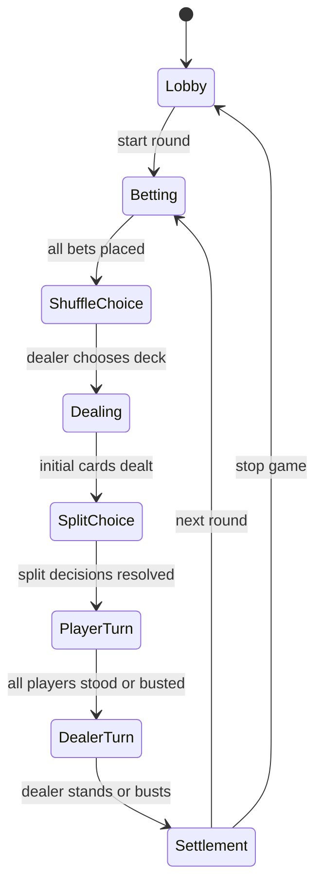

# 规则与状态机草案

## 当前朋友局规则

这是项目当前采用的基础桌规，后续如果你们实际玩法还有细节差异，再继续修正。

- 使用一副 52 张牌。
- A 可以算 1 或 11，按对当前玩家最有利且不爆牌的方式计算。
- J/Q/K 算 10。
- 点数超过 21 爆牌。
- 庄家和闲家都遵守同一行动限制：点数小于等于 13 时必须要牌。
- 点数大于 13 后，可以选择要牌或停牌。
- 初始牌如果是一对子，庄家和闲家都可以选择拆分。
- 拆分后需要额外下注一份，下注金额默认与原手牌一致。
- 拆分后不能再次拆分。
- 拆分后的两份牌都按普通手牌规则行动和结算。
- 拆分 A 后也可以正常补牌，没有只能补一张的限制。
- 多手牌拆分后，特殊牌型倍数依然生效。
- 下注尺度默认 10 到 50，按 10 递增；最小下注、最大下注、下注步长都应做成房间参数。
- 同样点数时，庄家赢。
- 普通胜负按 1 倍下注结算。
- 21 点按 2 倍下注结算。
- 一对 A 按 3 倍下注结算。
- 五小牛：玩家手牌达到 5 张牌，包括起始 2 张，且总点数不超过 21；按 5 倍下注结算。
- 特殊牌型大小顺序：五小牛最大，一对 A 其次，21 点最小。
- 闲家爆牌后不立即判输；如果庄家后续也爆牌，则闲家得分。
- 庄家手牌在闲家行动阶段为暗牌。
- 所有闲家本轮都结束后，进入庄家要牌环节时亮出庄家手牌。
- 房间人数可选 3 到 5 人；房间未满员时，玩家可随时加入。
- 中途加入的玩家本局先旁观，从下一局开始参与。
- 初始筹码默认 500。
- 筹码可以为负数。
- 庄家不需要下注，庄家与每个闲家一一结算。
- 庄家要牌后如果爆牌，下局下庄，由逆时针下一名玩家坐庄。
- 庄家发牌前可以选择是否重新洗牌。
- 未重新洗牌时，用过的牌不会在下次洗牌前再次出现。
- 如果牌库不够完成发牌，系统自动把已用过的牌洗回牌库。

## 朋友局轮庄模型

当前采用：

- 庄家要牌后爆牌，则下庄。
- 新庄家为当前庄家的逆时针下一名玩家。
- 如果庄家未因要牌爆牌，则继续坐庄。
- 庄家停牌后即使输给闲家，只要没有因为要牌爆牌，也继续坐庄。
- 如果庄家离开或断线超时，按逆时针顺序寻找下一名可坐庄玩家。

## 局内流程

## 关键状态

Lobby:

- 玩家加入、离开、调整设置。
- 房间人数由房主在 3 到 5 人之间选择。
- 房间未满员时允许新玩家加入。
- 中途加入的玩家本局状态为旁观，从下一局开始参与下注和行动。
- 房主可以开始游戏。

Betting:

- 非庄家玩家下注。
- 下注必须符合房间参数：最小下注、最大下注、下注步长。
- 默认下注范围为 10 到 50，按 10 递增。

ShuffleChoice:

- 庄家在发牌前选择是否重新洗牌。
- 不重新洗牌时，从当前剩余牌库继续发牌。
- 如果剩余牌不足，系统自动把弃牌堆/已用牌洗回牌库。

Dealing:

- 服务端根据牌库状态发初始牌。
- 用过的牌进入已用牌集合，不会在下次洗牌前再次出现。
- 识别特殊牌型：21 点、一对 A、五小牛。

SplitChoice:

- 如果初始牌是一对子，对应玩家可以选择拆分。
- 庄家和闲家都可以拆分。
- 拆分需要额外下注一份，默认金额与原手牌相同。
- 拆分追加下注固定等于原下注，不允许另选金额。
- 拆分后形成两份独立手牌。
- 拆分后不能再次拆分。
- 拆分 A 后也按普通拆分手牌行动，可以继续正常补牌。
- 拆分手牌按普通手牌继续行动和结算。
- 拆分手牌仍可触发特殊牌型倍数。

PlayerTurn:

- 按座位顺序行动。
- 当前玩家可以要牌或停牌。
- 点数小于等于 13 时只能要牌。
- 闲家爆牌后该手牌停止行动，但不立即判输，等待庄家结果。

DealerTurn:

- 进入庄家要牌环节时，庄家手牌亮出。
- 庄家按同样规则行动：小于等于 13 必须要牌，大于 13 可以要牌或停牌。
- 如果庄家要牌后爆牌，本局进入结算，且下一局下庄。

Settlement:

- 计算每位玩家输赢。
- 更新筹码。
- 写入每局记录。
- 准备下一局庄家。
- 庄家不下注，也没有统一庄家池。
- 每个闲家与庄家按自己的下注和牌型独立结算。
- 如果闲家拆分，则该闲家的两份手牌都按原下注金额分别与庄家结算。
- 如果庄家拆分，则庄家的两份手牌分别与每一个闲家结算。
- 闲家赢时，闲家筹码增加，庄家筹码减少。
- 闲家输时，闲家筹码减少，庄家筹码增加。
- 筹码允许结算为负数。
- 按特殊牌型倍数结算：21 点 2 倍、一对 A 3 倍、五小牛 5 倍。
- 特殊牌型大小顺序为：五小牛 > 一对 A > 21 点。
- 同点数庄家赢。
- 闲家爆牌但庄家也爆牌时，闲家得分。

## 点数计算

- 普通数字牌按牌面点数计算。
- J/Q/K 都按 10 点计算。
- A 先按 11 点计入，再在总点数超过 21 时按需把 A 从 11 调整为 1。
- 如果有多个 A，逐个调整，直到总点数不超过 21，或所有 A 都已按 1 计算。
- 用最终不爆牌的最大点数作为该手牌点数。
- 如果所有 A 都按 1 计算后仍超过 21，则该手牌爆牌。

示例：

- A + 9 = 20。
- A + 9 + 5 = 15。
- A + A + 9 = 21。
- A + A + 9 + K = 21。

## 状态机设计建议

- 游戏状态用有限状态机实现，不用散落的布尔值控制流程。
- 每个玩家操作都定义成命令：place_bet、choose_shuffle、split、hit、stand、start_round、next_round。
- 每个命令都有明确的合法状态、合法玩家和结果。
- 结算逻辑写成纯函数，方便单元测试。
