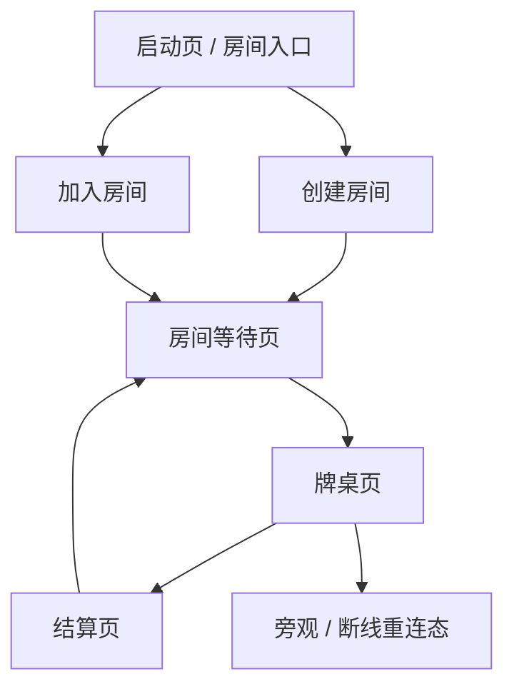

# 手机在线版 UI 重设计方案

目标：把当前“离线牌桌 + 在线房间面板”的原型，重构为真正的在线房间游戏流程。用户打开页面时应该先清楚地创建或加入房间；进入房间后才看到牌桌。移动端优先，所有关键按钮必须固定在可触达区域，不能被牌桌、头像、toast 或房间信息遮挡。

## 核心原则

- 阶段分离：进入页、房间等待页、牌桌页、结算页分别呈现，不把所有功能堆在同一个屏幕。
- 手机优先：默认按 390x844、375x812、430x932 设计，再适配桌面。
- 单屏单任务：创建/加入房间时不显示牌桌；下注/要牌时不显示创建房间表单。
- 操作只属于自己：玩家只看到自己的完整手牌和自己的操作区；其他玩家以桌边头像、筹码、下注、状态、牌背展示。
- 信息分层：牌桌中心只放当前局状态和牌堆；个人操作放底部；房间/设置放顶部或抽屉。
- 安全区域：底部操作栏避开 iOS/Android 手势区，使用 `safe-area-inset-bottom`。

## 页面流程



## 1. 启动页 / 房间入口

打开页面后的第一屏，不出现牌桌。

内容：
- 游戏名：`朋友局 21 点`
- 主要按钮：`创建房间`
- 次要入口：`输入房间号加入`
- 昵称输入：默认记住上次昵称
- 简短状态：当前后端连接状态，例如 `在线服务已连接`
- 高级设置折叠：后端地址、规则参数，仅调试时打开

移动端布局：
- 顶部 20%：品牌和一句话说明
- 中部：两个大按钮，一主一次
- 下部：昵称和房间号输入
- 底部：服务状态、版本号

交互：
- 点 `创建房间`：直接创建 5 人默认房间，成功后进入房间等待页。
- 输入 6 位房间号后点 `加入房间`：成功后进入房间等待页。
- 如果服务冷启动：按钮显示加载态，提示 `服务器正在唤醒，稍等几秒`。

## 2. 房间等待页

创建或加入后进入。还未开始游戏，不显示完整牌桌。

内容：
- 房间号：大号显示，提供复制按钮
- 玩家列表：头像、昵称、筹码、状态
- 当前人数：`3/5`
- 本桌规则摘要：下注 10-50、<=13 必须要牌、特殊牌型倍率
- 房主/庄家按钮：`开始游戏`
- 普通玩家状态：`等待房主开始`

移动端布局：
- 顶部：房间号 + 分享/复制
- 中部：玩家座位列表或简化圆桌预览
- 底部固定：`开始游戏` 或 `等待开始`

交互：
- 未满 3 人时，开始按钮禁用并提示 `至少 3 人开始`。
- 中途加入者如果牌局正在进行，进入旁观态，显示 `下一局加入`。

## 3. 牌桌页

进入游戏后显示圆桌。这个页面是核心体验。

### 手机竖屏布局

```text
┌─────────────────────────┐
│ 顶部状态栏：房间号/局数/牌库/菜单 │
├─────────────────────────┤
│        庄家座位          │
│   左玩家      右玩家      │
│        桌面中心          │
│   左下玩家    右下玩家    │
├─────────────────────────┤
│        我的手牌区域       │
├─────────────────────────┤
│        我的操作栏         │
└─────────────────────────┘
```

顶部状态栏：
- 房间号
- 第几局
- 当前回合
- 牌库数量
- 菜单按钮

桌面中心：
- 当前状态：`等待阿周行动`、`庄家亮牌中`、`结算完成`
- 牌堆和弃牌
- 最近一条事件，不显示长日志列表

桌边玩家：
- 头像
- 昵称
- 筹码
- 当前下注
- 状态：等待、行动中、停牌、爆牌、旁观
- 牌：非自己只显示牌背和张数；庄家未亮牌时显示暗牌

我的区域：
- 固定在底部操作栏上方
- 显示自己的手牌、点数、下注、特殊牌型提示
- 如果拆分，横向 tab 或左右两手分区展示：`手牌 1`、`手牌 2`

底部操作栏：
- 玩家回合：`要牌`、`停牌`、`拆分`、`下注`
- 庄家回合：`要牌`、`停牌`、`亮牌`
- 非本人回合：显示 `等待其他玩家`，按钮禁用或收起
- 旁观者：显示 `旁观中，下一局参与`

关键约束：
- `创建房间 / 加入房间` 不出现在牌桌页。
- `开始游戏 / 下一局` 只能在房间等待页或结算页出现。
- 牌桌座位不得覆盖底部操作栏。
- toast 出现在桌面中心偏上，不能覆盖操作按钮。

## 4. 下注与拆分

下注不应该一直占用大面积空间。

方案：
- 轮到自己下注时，底部操作栏切换为下注模式。
- 使用步进器：`- 10`、金额、`+ 10`
- 快捷筹码：`10`、`20`、`30`、`40`、`50`
- 确认按钮：`确认下注`

拆分：
- 只在起手对子时显示 `拆分`。
- 点击后弹出确认层：`拆分会额外下注 20，形成两手牌`
- 拆分后我的手牌区展示两个手牌 tab。

## 5. 结算页

一局结束后不马上把结果塞在牌桌里。

内容：
- 本局结果摘要：赢/输/平、筹码变化
- 每个玩家与庄家的结算列表
- 特殊牌型高亮：21 点、一对 A、五小牛
- 下一局信息：是否换庄、谁是下一庄
- 按钮：`下一局`

移动端：
- 结算以底部半屏弹层或全屏结果页出现。
- 牌桌背景保留但变暗，避免用户迷失。

## 6. 断线、刷新、旁观

断线恢复：
- 如果本地有 `roomCode` 和 `playerId`，启动页显示 `继续房间`。
- 点击后拉取房间状态，成功则进入等待页或牌桌页。

旁观：
- 筹码为 0 或中途加入当前局时，进入旁观模式。
- 旁观者看桌面、玩家状态和公开牌，但没有操作栏。

## 7. 桌面端适配

桌面端可以更接近德州扑克房间：
- 顶部房间栏
- 中央大圆桌
- 玩家围桌一圈
- 右侧轻量菜单
- 底部我的操作区

但桌面端不能影响手机端。实现时以移动端 CSS 为基础，再用大屏媒体查询增强。

## 8. 视觉方向

- 保留德州扑克式深色房间和绿色牌桌。
- 不使用“表格玩家列表”作为牌桌核心。
- 头像使用圆形，玩家信息卡控制在 2 行以内。
- 非自己玩家卡片尽量小：头像 + 名字 + 筹码 + 状态。
- 我的手牌和操作按钮最大、最清楚。
- 特殊牌型用短动画和高亮，不用遮挡全屏。

## 9. 实现拆分建议

前端阶段状态：
- `entry`：启动页
- `lobby`：房间等待页
- `table`：牌桌页
- `settlement`：结算页

HTML 结构建议：
- `.entry-screen`
- `.lobby-screen`
- `.game-screen`
- `.settlement-sheet`

CSS 策略：
- 先写移动端默认样式。
- 桌面端用 `@media (min-width: 800px)` 增强。
- 底部操作栏使用 `position: sticky` 或固定区域，不与牌桌绝对定位混用。
- 玩家座位用 CSS grid 进行移动端排布，桌面端再切换为绝对定位圆桌。

验收标准：
- 375px 宽手机上，创建/加入按钮首屏可见。
- 进入牌桌后，没有房间创建表单。
- 牌桌操作按钮不被任何头像、手牌、toast 覆盖。
- 轮不到自己时，操作区明确显示等待状态。
- 其他玩家不显示明牌，除非规则允许。
- 刷新页面后可以继续当前房间。
